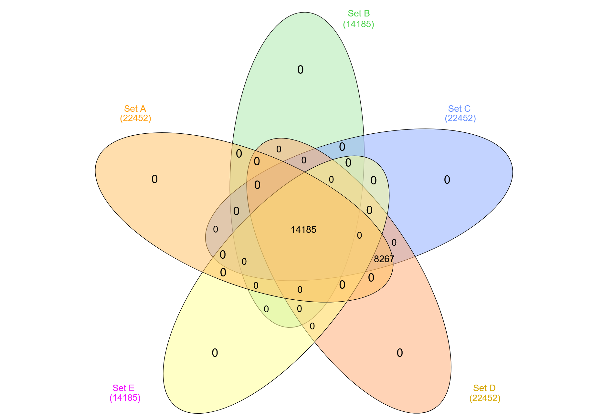

# breast-cancer-gene-signature-analysi
"Identification of core gene signatures across multiple GEO microarray datasets (GSE20685, GSE2990, GSE42568, GSE54002, GSE41998) utilizing Venn diagram intersection analysis."
# Gene Expression Intersection Analysis Across Multiple GEO Datasets

## 📌 Overview
This repository contains the data and intersection analysis results of gene expression profiles across multiple distinct Gene Expression Omnibus (GEO) datasets. The primary objective of this project is to identify core, consistently expressed gene signatures by cross-referencing multiple cohorts (Set A through Set F) using Venn diagram intersection methodologies. 

This robust approach helps isolate key biomarkers and significant genes that overlap across independent studies, which is highly valuable for downstream functional analysis and research paper preparation.

### 🧬 Datasets Analyzed
The analysis integrates data from the following GEO accessions:
* **Set A:** GSE20685
* **Set B:** GSE2990
* **Set C:** GSE42568
* **Set D:** GSE54002
* **Set E:** GSE41998
* **Set F:** Additional Cohort Data

## 📂 Repository Contents

| File Name | Description |
| :--- | :--- |
| `dataset_20260203_1210.xlsx - Sets.csv` | The base datasets containing the compiled lists of differentially expressed genes from each GEO accession. |
| `venn_intersections_20260203_1210.xlsx - Intersections.csv` | Comprehensive tabular data detailing the exact genes found in every possible intersection (e.g., A∩B, A∩C∩D) across the datasets. |
| `Removed None genes in 5 datasets.xlsx - Sheet1.csv` | The final, cleaned list of the absolute core genes present across the 5 primary datasets (Set A ∩ Set B ∩ Set C ∩ Set D ∩ Set E), with empty values removed. |
| `venn_diagram_20260203_1210.png` | A visual representation of the gene overlaps across the analyzed sets. |

## 📊 Visual Analysis

*(Note: Ensure the image file is uploaded to the root of your repository for this visualization to render correctly).*

## 🔬 Methodology & Key Findings
1.  **Data Extraction:** Gene lists were gathered from the respective GEO datasets.
2.  **Intersection Analysis:** A multi-set Venn analysis was performed to isolate overlapping genes. 
3.  **Data Cleaning:** Unmapped or "None" genes were strictly filtered out to ensure a high-confidence final target list.
4.  **Result:** The intersection successfully isolated a highly specific subset of genes (including *THSD4, CTSC, TBC1D9, MRTFB*, etc.) that are consistently present across all five primary datasets. These genes represent high-confidence targets for further functional annotation and biological pathway analysis.

## 🛠️ How to Use This Repository
To clone this repository and explore the datasets locally, run the following command in your terminal:

```bash
git clone [https://github.com/DrNagendra619/breast-cancer-gene-signature-analysis.git](https://github.com/DrNagendra619/breast-cancer-gene-signature-analysis.git)
